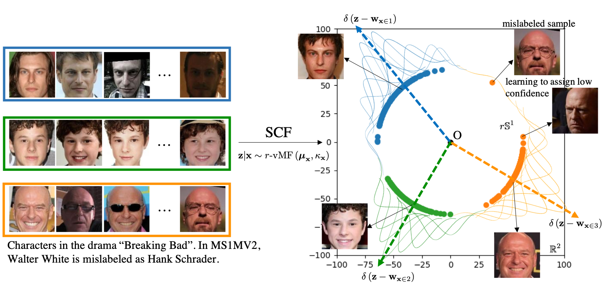

# Sphere Confidence Face (SCF)

This repository contains the PyTorch implementation of Sphere Confidence Face (SCF) proposed in the CVPR2021 paper: [Spherical Confidence Learning for Face Recognition](https://openaccess.thecvf.com/content/CVPR2021/papers/Li_Spherical_Confidence_Learning_for_Face_Recognition_CVPR_2021_paper.pdf) with [Appendices](https://openaccess.thecvf.com/content/CVPR2021/supplemental/Li_Spherical_Confidence_Learning_CVPR_2021_supplemental.pdf).

<p align="center">
   
</p>

## Main Results
...

## Requirements
* python==3.6.0
* torch==1.6.0
* torchvision==0.7.0
* tensorboard==2.4.0

## Getting Started
### Training
Training consists of two separate steps:
1. Train ResNet100 imported from backbones.py as the deterministic backbone using spherical loss, e.g. [ArcFace](https://github.com/deepinsight/insightface/tree/master/recognition/arcface_torch) loss.
2. Train SCF based on the pretrained backbone by specifying the arguments including [GPU_IDS], [OUTPUT_DIR], [PATH_BACKBONE_CKPT] (the path of the pretrained backbone checkpoint) and [PATH_FC_CKPT] (the path of the pretrained fc-layer checkpoint) and then running the command:

``` bash
python train.py \
    --dataset "ms1m" \
    --seed 777 \
    --gpu_ids [GPU_IDS] \
    --batch_size 1024 \
    --output_dir [OUTPUT_DIR] \
    --saved_bkb [PATH_BACKBONE_CKPT] \
    --saved_fc [PATH_FC_CKPT] \
    --num_workers 8 \
    --epochs 30 \
    --lr 3e-5 \
    --lr_scheduler "StepLR" \
    --step_size 2 \
    --gamma 0.5 \
    --convf_dim 25088 \
    --z_dim 512 \
    --radius 64 \
    --max_grad_clip 0 \
    --max_grad_norm 0 \
    --tensorboard
```

### Test

IJB benchmark: use $\kappa$ as confidence score for each face image to aggregate representations as in Eqn (14). Refer to [the standard IJB benchmark](https://github.com/deepinsight/insightface/tree/master/recognition/_evaluation_/ijb) for implementation.

1v1 verification benchmark: use Eqn (13) as the similarity score.
$$\begin{equation}s(\mathbf{x}^i, \mathbf{x}^j)=\log \mathcal{C}_{d}\left(\kappa^{i}\right)+\log \mathcal{C}_{d}\left(\kappa^{j}\right)-\log \mathcal{C}_{d}(|| \kappa^i \boldsymbol{\mu}^i + \kappa^j \boldsymbol{\mu}^j||_2)-d \log r \end{equation}$$

## Other Implementations
SCF in TFace: [SCF](https://github.com/Tencent/TFace/tree/master/tasks/scf)

## Citation
```
@inproceedings{li2021spherical,
  title={Spherical Confidence Learning for Face Recognition},
  author={Li, Shen and Xu, Jianqing and Xu, Xiaqing and Shen, Pengcheng and Li, Shaoxin and Hooi, Bryan},
  booktitle={Proceedings of the IEEE/CVF Conference on Computer Vision and Pattern Recognition},
  pages={15629--15637},
  year={2021}
}
```
